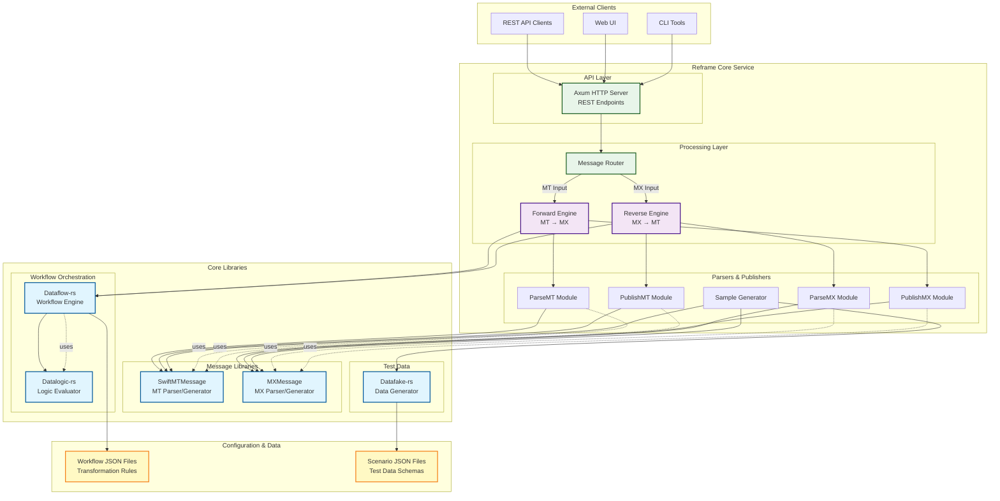
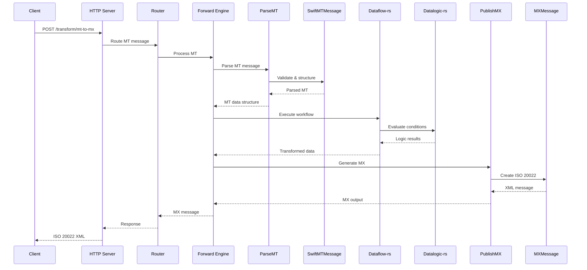
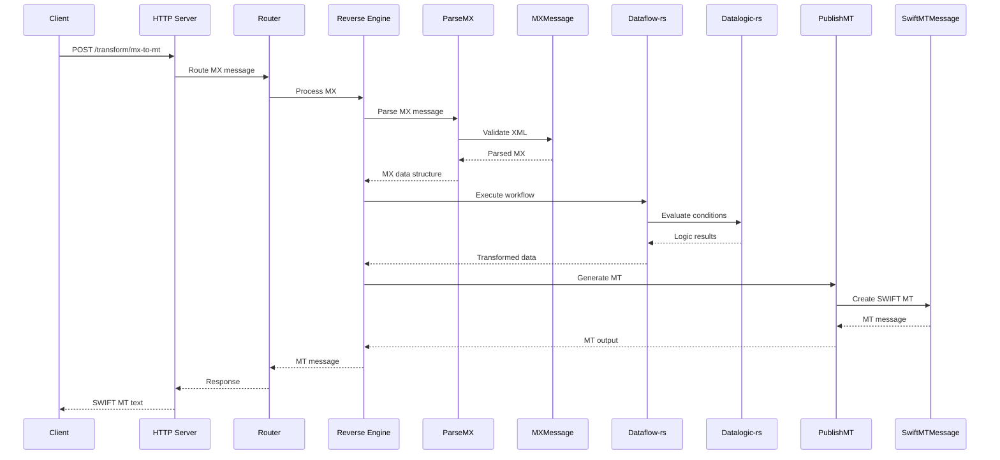
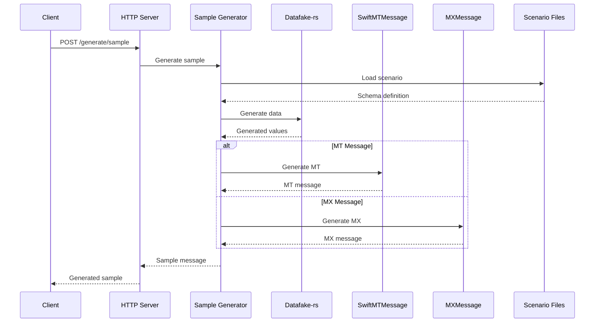
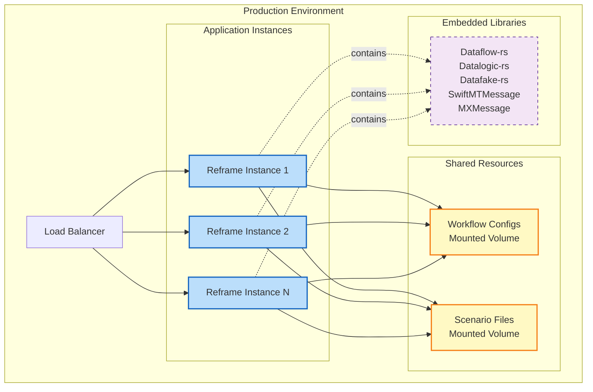

# Reframe Architecture Document

## Overview

Reframe is an enterprise-grade bidirectional SWIFT MT ↔ ISO 20022 transformation service built in Rust. It leverages a suite of custom-built libraries to provide high-performance, transparent, and configurable message transformations for financial institutions.

## Core Libraries

### 1. **Dataflow-rs** (Workflow Engine)
- **Purpose**: JSON-based workflow orchestration engine
- **Role**: Executes transformation pipelines defined in JSON configuration files
- **Location**: `../dataflow-rs`

### 2. **Datalogic-rs** (Logic Engine)
- **Purpose**: JSONLogic implementation for declarative transformation rules
- **Role**: Evaluates conditional logic and business rules during transformations
- **Location**: `../datalogic-rs`

### 3. **Datafake-rs** (Data Generation)
- **Purpose**: Test data generation from JSON schemas
- **Role**: Creates realistic sample messages for testing and validation
- **Location**: `../datafake-rs`

### 4. **SwiftMTMessage** (MT Message Library)
- **Purpose**: SWIFT MT message parsing and generation
- **Role**: Handles MT message structure, validation, and serialization
- **Location**: `../SwiftMTMessage`

### 5. **MXMessage** (ISO 20022 Library)
- **Purpose**: ISO 20022 (MX) message parsing and generation
- **Role**: Manages MX message schemas, validation, and XML serialization
- **Location**: `../MXMessage`

## Architecture Diagram

## Data Flow Diagrams

### Forward Transformation (MT → ISO 20022)

### Reverse Transformation (ISO 20022 → MT)

### Sample Generation Flow

## Library Dependencies and Interactions

### 1. **Dataflow-rs ↔ Datalogic-rs**
- Dataflow-rs orchestrates workflow execution
- Calls Datalogic-rs for conditional logic evaluation
- Datalogic-rs provides JSONLogic operators for transformations

### 2. **SwiftMTMessage Integration**
- Used by ParseMT for parsing incoming MT messages
- Used by PublishMT for generating MT output
- Provides MT message validation and structure definitions

### 3. **MXMessage Integration**
- Used by ParseMX for parsing ISO 20022 XML
- Used by PublishMX for generating MX output
- Provides MX schema validation and XML serialization

### 4. **Datafake-rs Integration**
- Used by Sample Generator for test data creation
- Reads scenario JSON schemas
- Generates realistic financial data using faker patterns

### 5. **Workflow Configuration**
- Dataflow-rs reads workflow JSON files
- Workflows define transformation pipelines
- Each workflow step can invoke Datalogic-rs for conditions

## Component Responsibilities

### Reframe Core
- **HTTP Server**: Request handling, routing, response formatting
- **Forward Engine**: Manages MT→MX transformation pipeline
- **Reverse Engine**: Manages MX→MT transformation pipeline
- **Message Router**: Determines transformation direction

### Library Responsibilities

| Library | Primary Responsibility | Key Features |
|---------|----------------------|--------------|
| **Dataflow-rs** | Workflow orchestration | JSON-based workflows, pipeline execution, task management |
| **Datalogic-rs** | Business logic evaluation | JSONLogic operators, conditional rules, data manipulation |
| **Datafake-rs** | Test data generation | Faker patterns, schema-based generation, realistic values |
| **SwiftMTMessage** | MT message handling | MT parsing, validation, generation, field definitions |
| **MXMessage** | MX message handling | XML parsing, schema validation, ISO 20022 structures |

## Deployment Architecture

## Key Design Patterns

### 1. **Engine Pattern**
- Separate engines for forward and reverse transformations
- Engines are initialized once and reused across requests
- Each engine maintains its own workflow pipeline

### 2. **Plugin Architecture**
- Libraries are plugged into the core service
- Each library has a specific interface and responsibility
- Easy to extend or replace individual components

### 3. **Configuration-Driven**
- Workflows defined in JSON for transparency
- Business rules externalized via Datalogic-rs
- Scenarios for test data also in JSON format

### 4. **Pipeline Processing**
- Dataflow-rs orchestrates multi-step transformations
- Each step can be independently configured
- Supports conditional branching via Datalogic-rs

## Performance Considerations

1. **Rust Performance**: All libraries built in Rust for maximum performance
2. **Stateless Design**: Each request is independent, enabling horizontal scaling
3. **Engine Reuse**: Engines initialized once, avoiding repeated setup overhead
4. **Efficient Parsing**: Specialized parsers for MT and MX formats
5. **Memory Safety**: Rust's ownership model prevents memory leaks

## Future Architecture Considerations

1. **Library Versioning**: Semantic versioning for coordinated updates
2. **Plugin System**: Dynamic library loading for runtime extensions
3. **Caching Layer**: Potential for workflow result caching
4. **Distributed Processing**: Message queue integration for async processing
5. **Monitoring Integration**: Metrics collection across all libraries