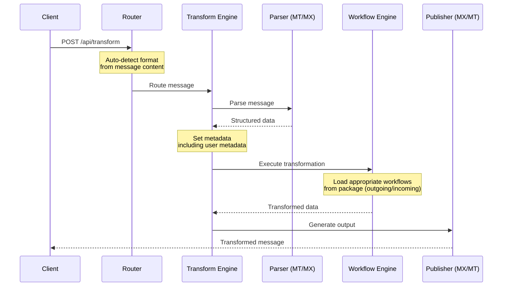

# 🏗️ Reframe v3.1.1: Technical Architecture & Design

## Table of Contents

- [Overview](#overview)
- [Core Design Principles](#core-design-principles)
- [System Architecture](#system-architecture)
- [Core Components](#core-components)
- [Package Management](#package-management)
- [Configuration System](#configuration-system)
- [Core Libraries](#core-libraries)
- [Data Flow & Processing](#data-flow--processing)
- [SR2025 Compliance](#sr2025-compliance)
- [Technology Stack](#technology-stack)
- [Performance Architecture](#performance-architecture)
- [Deployment Architecture](#deployment-architecture)
- [Monitoring & Observability](#monitoring--observability)

---

## Overview

Reframe v3.1.1 is an enterprise-grade bidirectional SWIFT MT ↔ ISO 20022 transformation engine built in Rust. This release introduces a unified package-based architecture with configuration-driven design, providing financial institutions with a transparent, high-performance, and fully auditable message transformation solution.

### What's New in v3.1.1

- **Package-Based Architecture**: External workflow packages with reframe-package.json configuration
- **Configuration-Driven**: Runtime configuration via reframe.config.json with environment variable overrides
- **Unified Transformation Engine**: Single bidirectional engine handling both MT→MX and MX→MT transformations
- **GraphQL API**: Query transformation history with custom fields support
- **Custom Fields**: Package-specific computed fields using JSONLogic expressions
- **Database Integration**: MongoDB persistence with audit trail
- **Metadata Support**: User-provided metadata for workflow customization
- **Hot-Reload Capability**: Update workflows without service restart
- **Simplified API**: Unified endpoints with automatic message detection
- **SR2025 Compliance**: Full implementation of SWIFT's November 2025 standards release

---

## Core Design Principles

### 🔍 **Complete Transparency**
- All transformation logic externalized in human-readable JSON
- Package-based workflow organization
- Full audit trail for compliance and debugging
- No proprietary black boxes or hidden logic

### ⚡ **High Performance**
- Sub-millisecond transformation latency
- Rust-powered for memory safety and speed
- Async runtime with Tokio for concurrent processing
- Zero-copy parsing where possible

### 🔧 **Configuration-Driven Architecture**
- External package-based workflow system
- Runtime configuration via reframe.config.json
- Environment variable overrides for deployment flexibility
- Hot-reloadable workflow configurations

### 📊 **Workflow-Driven**
- Declarative transformation pipelines
- JSONLogic-based business rules
- Version-controlled configuration
- Visual workflow representation

### 🔄 **True Bidirectional Design**
- Unified engine for both directions
- Automatic message format detection
- Symmetric transformation capabilities
- Consistent handling of edge cases

### 🏢 **Enterprise-Ready**
- Production-grade error handling
- Comprehensive monitoring and metrics
- Container-native deployment
- Horizontal scaling support

---

## System Architecture

### High-Level Architecture Diagram

```mermaid
graph TB
    subgraph "External Systems"
        CLIENT[REST API Clients]
        WEB[Web Applications]
        CLI[CLI Tools]
    end

    subgraph "API Gateway Layer"
        HTTP[Axum HTTP Server<br/>REST API v3.1.1]
        AUTH[Authentication]
    end

    subgraph "Processing Core"
        ROUTER[Intelligent Message Router<br/>Auto Format Detection]

        subgraph "Unified Engines"
            TRANSFORM_ENGINE[Transform Engine<br/>Bidirectional MT ↔ MX]
            GENERATION_ENGINE[Generation Engine<br/>Sample Messages]
            VALIDATION_ENGINE[Validation Engine<br/>Message Compliance]
        end
    end

    subgraph "Message Processing"
        subgraph "Parsers"
            PARSE_MT[MT Parser<br/>SWIFT MT Format]
            PARSE_MX[MX Parser<br/>ISO 20022 XML]
        end

        subgraph "Publishers"
            PUB_MT[MT Publisher<br/>Generate MT]
            PUB_MX[MX Publisher<br/>Generate XML]
        end

        subgraph "Generators"
            SAMPLE_GEN[Sample Generator<br/>Test Data Creation]
            BAH_GEN[BAH Generator<br/>Business Headers]
        end
    end

    subgraph "Workflow Engine"
        DATAFLOW[Dataflow-rs<br/>Pipeline Orchestration]
        DATALOGIC[Datalogic-rs<br/>Business Logic]
        VALIDATOR[SR2025 Validator<br/>Compliance Rules]
    end

    subgraph "Package Management"
        PKG_MGR[Package Manager<br/>Discovery & Loading]

        subgraph "External Package"
            PKG_CONFIG[reframe-package.json<br/>Package Configuration]
            WF_TRANSFORM[Transform Workflows<br/>Bidirectional Rules]
            WF_GENERATE[Generate Workflows<br/>Sample Creation]
            WF_VALIDATE[Validate Workflows<br/>Compliance Checks]
            SCENARIOS[Test Scenarios<br/>Sample Data]
        end
    end

    subgraph "Configuration"
        CONFIG[reframe.config.json<br/>Runtime Configuration]
        ENV_VARS[Environment Variables<br/>Deployment Overrides]
    end

    subgraph "Observability"
        LOGS[Structured Logging<br/>tracing/env_logger]
        METRICS[Prometheus Metrics]
        HEALTH[Health Checks]
    end

    %% Connections
    CLIENT --> HTTP
    WEB --> HTTP
    CLI --> HTTP

    HTTP --> AUTH
    AUTH --> ROUTER

    ROUTER -->|Auto-detect format| TRANSFORM_ENGINE
    ROUTER -->|Generate request| GENERATION_ENGINE
    ROUTER -->|Validate request| VALIDATION_ENGINE

    TRANSFORM_ENGINE --> PARSE_MT
    TRANSFORM_ENGINE --> PARSE_MX
    TRANSFORM_ENGINE --> DATAFLOW
    TRANSFORM_ENGINE --> PUB_MT
    TRANSFORM_ENGINE --> PUB_MX

    GENERATION_ENGINE --> SAMPLE_GEN
    GENERATION_ENGINE --> DATAFLOW

    VALIDATION_ENGINE --> PARSE_MT
    VALIDATION_ENGINE --> PARSE_MX
    VALIDATION_ENGINE --> DATAFLOW

    DATAFLOW --> DATALOGIC
    DATAFLOW --> VALIDATOR
    DATAFLOW --> WF_TRANSFORM
    DATAFLOW --> WF_GENERATE
    DATAFLOW --> WF_VALIDATE

    SAMPLE_GEN --> SCENARIOS

    TRANSFORM_ENGINE --> PKG_MGR
    GENERATION_ENGINE --> PKG_MGR
    VALIDATION_ENGINE --> PKG_MGR

    PKG_MGR --> PKG_CONFIG
    PKG_MGR --> CONFIG
    CONFIG --> ENV_VARS

    ROUTER --> LOGS
    DATAFLOW --> LOGS
    HTTP --> METRICS
    HTTP --> HEALTH
```



---

## Core Components

### 1. **Main Server** (`src/main.rs`)
- Initializes Axum HTTP server
- Sets up unified route handlers
- Manages engine lifecycle
- Loads configuration from reframe.config.json

### 2. **API Handlers** (`src/handlers.rs`)
- **Unified Transform Handler**: Auto-detects message format and direction
- **Generate Handler**: Creates sample messages for testing
- **Validate Handler**: Validates MT and MX messages
- **Admin Handlers**: Workflow reload and package management
- Request validation with metadata support
- Response formatting and error handling

### 3. **Package Manager** (`src/package_manager.rs`)
- Package discovery and loading from reframe.config.json
- Package validation and version compatibility
- Configuration management with environment variable overrides
- Runtime package information and metadata

### 4. **Transformation Engines** (`src/engine.rs`)
- **Transform Engine**: Unified bidirectional MT ↔ ISO 20022 transformations
- **Generation Engine**: Sample message creation for both MT and MX
- **Validation Engine**: Message compliance checking for both formats
- Workflow orchestration using dataflow-rs
- Hot-reload capability without service restart
- Package-based workflow loading

### 5. **Message Parsers**
- **MT Parser** (`src/parse_mt.rs`): Custom SWIFT MT parser with field validation
- **MX Parser** (`src/parse_mx.rs`): ISO 20022 XML parsing with schema validation
- **Validation Helpers** (`src/validation_helpers.rs`): Common validation utilities

### 6. **Message Generators**
- **MX Generator** (`src/mx_generator.rs`): JSON to ISO 20022 XML conversion
- **MT Generator** (`src/mt_generator.rs`): Structured data to SWIFT MT format
- **Sample Generator** (`src/sample_generator.rs`): Test data creation using datafake-rs

### 7. **Message Publishers**
- **MT Publisher** (`src/publish_mt.rs`): Format and publish MT messages
- **MX Publisher** (`src/publish_mx.rs`): Format and publish MX messages with proper namespaces

### 8. **Custom Fields Module** (`src/custom_fields.rs`)
- Package-specific computed fields using JSONLogic expressions
- Three storage strategies: precompute, runtime, and hybrid
- Field evaluation at storage and query time
- Error handling with graceful degradation

### 9. **Database Integration** (`src/database/`)
- **MongoDB Client** (`mongodb.rs`): Audit trail persistence with custom field support
- **Conversion Utilities** (`conversion.rs`): Message to/from database document conversion
- Custom field filtering and querying
- Transaction history and analytics

### 10. **GraphQL API** (`src/graphql/`)
- **Schema** (`schema.rs`): GraphQL query and mutation definitions
- **Types** (`types.rs`): GraphQL types with custom fields support
- Message querying with filters and pagination
- Package-specific custom field resolvers

### 11. **Scenario Management** (`src/scenario_loader.rs`)
- Load test scenarios from package
- Generate realistic test data
- Support for multiple message variants

### 12. **OpenAPI Documentation** (`src/openapi.rs`)
- Swagger/OpenAPI spec generation with runtime configuration
- Interactive API documentation
- Request/response examples
- Configurable server URLs and metadata

### 10. **Type Definitions** (`src/types.rs`)
- Common data structures and types
- Request/response models with metadata support
- AppState with three unified engines
- Error types for structured error handling

---

## Package Management

### Package Structure

External packages follow this standardized structure:

```
reframe-package-swift-cbpr/
├── reframe-package.json    # Package configuration
├── transform/
│   ├── index.json          # Unified workflow index
│   ├── outgoing/           # MT → MX transformations
│   │   ├── parse-mt.json
│   │   ├── MT103/
│   │   │   ├── bah-mapping.json
│   │   │   ├── document-mapping.json
│   │   │   ├── precondition.json
│   │   │   └── postcondition.json
│   │   └── combine-xml.json
│   └── incoming/           # MX → MT transformations
│       ├── parse-mx.json
│       └── pacs008/
│           ├── 01-variant-detection.json
│           ├── 02-preconditions.json
│           └── ...
├── generate/
│   ├── index.json
│   ├── generate-mt.json
│   └── generate-mx.json
├── validate/
│   ├── index.json
│   ├── validate-mt.json
│   └── validate-mx.json
└── scenarios/
    ├── index.json
    ├── outgoing/
    │   └── mt103_to_pacs008_cbpr_standard.json
    └── incoming/
        └── pacs008_to_mt103_cbpr_standard.json
```

### Package Configuration

**reframe-package.json**:

```json
{
  "id": "swift-cbpr-mt-mx",
  "name": "SWIFT CBPR+ MT <-> MX Transformations - SR2025",
  "version": "2.0.0",
  "description": "Official SWIFT CBPR+ transformations",
  "author": "Plasmatic Team",
  "license": "Apache-2.0",
  "engine_version": "3.1.1",
  "required_plugins": ["swift-mt-message", "mx-message"],
  "workflows": {
    "transform": {
      "path": "transform",
      "description": "Unified bidirectional transformation workflows",
      "entry_point": "index.json"
    },
    "generate": {
      "path": "generate",
      "description": "Sample message generation",
      "entry_point": "index.json"
    },
    "validate": {
      "path": "validate",
      "description": "Message validation workflows",
      "entry_point": "index.json"
    }
  },
  "scenarios": {
    "path": "scenarios",
    "description": "Test scenarios",
    "entry_point": "index.json"
  }
}
```

---

## Configuration System

### Runtime Configuration

**reframe.config.json** (project root):

```json
{
  "packages": [
    {
      "path": "../reframe-package-swift-cbpr",
      "enabled": true
    }
  ],
  "server": {
    "host": "0.0.0.0",
    "port": 3000,
    "runtime": {
      "tokio_worker_threads": "auto",
      "thread_name_prefix": "reframe-worker"
    }
  },
  "logging": {
    "format": "compact",
    "level": "info",
    "show_target": false,
    "show_thread": false,
    "show_file_location": false,
    "show_span_events": false,
    "file_output": {
      "enabled": false,
      "directory": "./logs",
      "file_prefix": "reframe",
      "rotation": "daily"
    }
  },
  "api_docs": {
    "enabled": true,
    "title": "Reframe API",
    "version": "3.1.1",
    "description": "Enterprise-grade bidirectional SWIFT MT ↔ ISO 20022 transformation service",
    "contact": {
      "name": "Plasmatic Team",
      "email": "enquires@goplasmatic.io"
    },
    "license": {
      "name": "Apache 2.0",
      "identifier": "Apache-2.0",
      "url": "https://opensource.org/license/apache-2-0"
    },
    "external_docs_url": "https://sandbox.goplasmatic.io",
    "server_url": "http://localhost:3000"
  },
  "defaults": {
    "package_id": null,
    "package_path": "../reframe-package-swift-cbpr"
  }
}
```

### Configuration Priority System

Configuration values are resolved in this order (highest to lowest priority):

1. **Environment Variables** (highest priority)
2. **reframe.config.json** file
3. **Built-in Defaults** (lowest priority)

### Environment Variables

| Variable | Description | Default |
|----------|-------------|---------|
| `REFRAME_PACKAGE_PATH` | Path to workflow package | `../reframe-package-swift-cbpr` |
| `TOKIO_WORKER_THREADS` | Async runtime worker threads | CPU count |
| `API_SERVER_URL` | OpenAPI server URL override | `http://localhost:3000` |
| `RUST_LOG` | Logging level | `info` |

---

## Core Libraries

### Dataflow-rs (Workflow Engine)
- **Purpose**: JSON-based workflow orchestration
- **Features**:
  - Declarative pipeline definitions
  - Conditional routing
  - Data transformation operators
  - Error handling and recovery

### Datalogic-rs (Logic Engine)
- **Purpose**: JSONLogic implementation for business rules
- **Features**:
  - Complex conditional evaluation
  - Variable substitution
  - Mathematical operations
  - String manipulation

### Datafake-rs (Data Generation)
- **Purpose**: Realistic test data generation
- **Features**:
  - Faker.js compatible API
  - Custom generators
  - Locale support
  - Reproducible data with seeds

### Swift-MT-Message (MT Library)
- **Purpose**: SWIFT MT message handling
- **Version**: 3.0+
- **Features**:
  - All MT message types
  - Field validation
  - Block structure parsing
  - SR2025 compliance

### MX-Message (ISO 20022 Library)
- **Purpose**: ISO 20022 message handling
- **Version**: 3.0+
- **Features**:
  - Complete message catalog
  - XML serialization/deserialization
  - Schema validation
  - BAH v3 support

---

## Data Flow & Processing

### Unified Transformation Flow



### Metadata Flow

User-provided metadata is merged into the workflow execution context:

```json
{
  "message": "<message content>",
  "metadata": {
    "priority": "high",
    "custom_field": "value"
  }
}
```

The workflow can access these values:
```json
{
  "logic": {
    "if": [
      {"==": [{"var": "metadata.priority"}, "high"]},
      "URGENT",
      "NORMAL"
    ]
  }
}
```

---

## SR2025 Compliance

### Key SR2025 Updates Implemented

1. **Business Application Header v3**
   - Enhanced party identification
   - Improved service level codes
   - Extended priority options

2. **Structured Remittance Information**
   - Creditor reference information
   - Structured reference types
   - Document adjustment details

3. **Enhanced Data Quality**
   - Mandatory UETR (Unique End-to-end Transaction Reference)
   - LEI (Legal Entity Identifier) support
   - Improved address structures

4. **New Message Types**
   - camt.105 - Billing report
   - camt.106 - Investigation response
   - camt.107 - Non-deliverable information
   - Additional pain and pacs variants

5. **Validation Enhancements**
   - Cross-field validation rules
   - Business rule enforcement
   - Format validation improvements

---

## Technology Stack

### Core Technologies

| Component | Technology | Version | Purpose |
|-----------|-----------|---------|---------|
| Language | Rust | 1.75+ | Core implementation |
| Async Runtime | Tokio | 1.47 | Asynchronous I/O |
| Web Framework | Axum | 0.8 | HTTP server |
| XML Processing | quick-xml | 0.38 | Fast XML parsing |
| JSON Processing | serde_json | 1.0 | JSON serialization |
| API Documentation | utoipa | 5.4 | OpenAPI generation |
| Logging | tracing/env_logger | Latest | Structured logging |
| Configuration | arc-swap | Latest | Lock-free config updates |

---

## Performance Architecture

### Design Optimizations

1. **Async Processing**
   - Tokio runtime for non-blocking I/O
   - Concurrent request handling
   - Efficient resource utilization
   - Automatic CPU core scaling

2. **Engine Caching**
   - Pre-loaded workflow engines
   - Arc-swap for zero-downtime reloads
   - Shared engine state across threads

3. **Zero-Copy Parsing**
   - Direct memory access for string operations
   - Minimal allocations during parsing
   - Reuse of buffers where possible

4. **Configuration System**
   - Lock-free configuration reads with ArcSwap
   - Hot-reload without service interruption
   - Package-based workflow loading

### Tokio Runtime Configuration

The async runtime automatically scales with available CPU cores:

```bash
# Auto-detection (default, uses all CPU cores)
cargo run --release

# Explicit configuration
TOKIO_WORKER_THREADS=4 cargo run --release

# Low-resource environment
TOKIO_WORKER_THREADS=1 cargo run
```

---

## Deployment Architecture

### Container Architecture

```dockerfile
# Multi-stage build
FROM rust:1.75 as builder
# Build optimized binary

FROM debian:bookworm-slim
# Minimal runtime with only required libraries
# Non-root user execution
# Health check endpoint
```

### Deployment Options

1. **Docker Standalone**
   - Single container deployment
   - Volume mounts for packages and config
   - Environment-based configuration

2. **Docker Compose**
   - Multi-container orchestration
   - Service dependencies
   - Network isolation

3. **Kubernetes**
   - Horizontal pod autoscaling
   - ConfigMaps for configuration and workflows
   - Ingress controllers
   - Service mesh integration

4. **Cloud Native**
   - AWS ECS/Fargate
   - Azure Container Instances
   - Google Cloud Run
   - OpenShift

### Scaling Strategy

- **Horizontal Scaling**: Stateless design allows linear scaling
- **Load Balancing**: Round-robin or least-connections
- **Auto-scaling**: Based on CPU/memory or request rate
- **Geographic Distribution**: Deploy close to users

---

## Monitoring & Observability

### Health Checks

```json
GET /health
{
  "status": "healthy",
  "timestamp": "2025-10-14T10:00:00Z",
  "engines": {
    "transform": "ready",
    "generation": "ready",
    "validation": "ready"
  },
  "capabilities": [
    "bidirectional_transformation",
    "sample_generation",
    "message_validation",
    "workflow_reload"
  ],
  "config": {
    "thread_count": 8
  }
}
```

### Logging Strategy

```rust
// Structured logging example
info!(
    message_type = "MT103",
    direction = "outgoing",
    duration_ms = 5,
    "Transformation completed successfully"
);
```

### Metrics Collection

Key metrics to monitor:
- Request throughput (requests/second)
- Transformation latency (milliseconds)
- Error rates by message type
- Engine workflow execution time
- Memory usage and GC pressure

---

## API Endpoints

### Unified Transformation API

- `POST /api/transform`: Unified bidirectional transformation
  - Auto-detects message format (MT or MX)
  - Supports optional `message_type_hint` for routing
  - Handles both MT → MX and MX → MT
  - Accepts user metadata for workflow customization

### Sample Generation

- `POST /api/generate`: Generate sample messages
  - Supports both MT and MX message types
  - Uses scenarios from package

### Validation

- `POST /api/validate`: Validate messages
  - Auto-detects and validates MT or MX
  - Returns validation status and errors

### Administration

- `POST /admin/reload-workflows`: Hot reload workflows from package
- `GET /api/packages`: List loaded packages with details
- `GET /health`: Health check with engine status
- `GET /swagger-ui`: Interactive API documentation
- `GET /api-docs/openapi.json`: OpenAPI specification

---

## Future Roadmap

### Near Term
- Kafka/RabbitMQ integration
- Enhanced monitoring dashboard
- Multi-package support (beyond single default package)
- Real-time WebSocket notifications

### Medium Term
- Plugin system for custom functions
- Multi-tenant support
- Cloud-native SaaS offering
- Performance optimization tools

### Long Term
- Real-time streaming transformations
- Machine learning for mapping suggestions
- Predictive error detection
- Cross-border payment optimization

---

## Conclusion

Reframe v3.1.1 represents a significant advancement with its unified package-based architecture. The configuration-driven design with external packages provides:

- **Scalability**: From single instances to global deployments
- **Maintainability**: Clear separation of concerns and modular design
- **Extensibility**: Easy to add new message types via packages
- **Observable**: Comprehensive monitoring and debugging capabilities
- **Secure**: Multiple layers of security and compliance features
- **Flexible**: Runtime configuration without recompilation

For more information, see our other documentation:
- [Configuration Guide](configuration.md) - Detailed configuration options
- [Installation Guide](installation.md) - Setup and deployment
- [Custom Fields Guide](custom-fields.md) - Package-specific computed fields and GraphQL API
- [Message Formats](message-formats.md) - Supported messages
