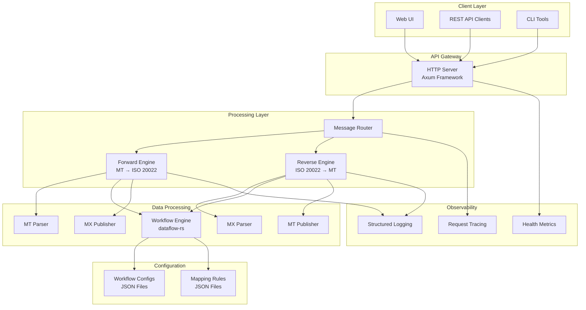
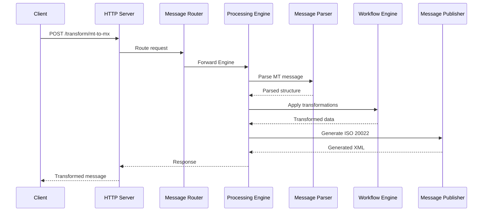
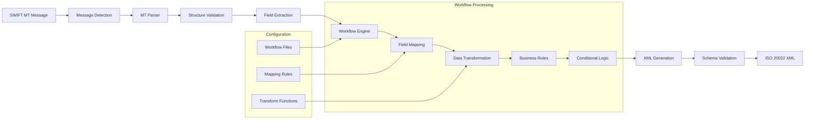
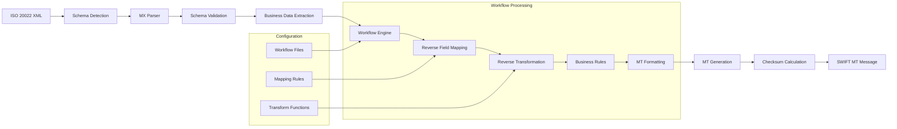
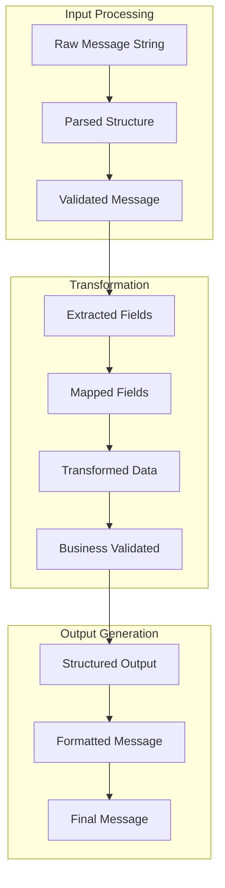
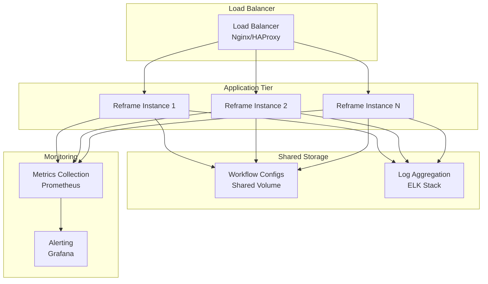

# 🏗️ Reframe: Technical Architecture Overview

This document provides a high-level overview of Reframe's technical architecture, design principles, and core components. It's designed to give you a solid understanding of how Reframe works under the hood.

## Table of Contents

- [Overview](#overview)
- [System Architecture](#system-architecture)
- [Core Components](#core-components)
- [Data Flow](#data-flow)
- [Technology Stack](#technology-stack)
- [Performance Design](#performance-design)
- [Security Architecture](#security-architecture)
- [Deployment Architecture](#deployment-architecture)

---

## Overview

Reframe is built to be a **high-performance**, **transparent**, and **scalable** message transformation engine. We've focused on creating a system that's easy to configure, reliable, and adaptable to the demands of modern financial institutions.

### Core Design Principles

*   **🔍 Complete Transparency**: No "black boxes" here! All transformation logic is externalized and auditable.
*   **⚡ High Performance**: Powered by Rust for lightning-fast processing and low latency.
*   **🔧 Pluggable Architecture**: Modular design allows for easy customization and extension.
*   **📊 Workflow-Driven**: JSON-based configuration provides complete control and flexibility.
*   **🔄 Bidirectional Design**: Specialized engines handle both forward (MT to MX) and reverse (MX to MT) transformations.
*   **🏢 Enterprise-Ready**: Robust error handling, monitoring, and observability features.

---

## System Architecture

### High-Level Architecture

Here's a diagram showing the main components of Reframe:



### Component Interaction



---

## Data Flow

### Forward Transformation Flow (MT → ISO 20022)



### Reverse Transformation Flow (ISO 20022 → MT)



### Data Structure Evolution



---

## Technology Stack

### Core Technologies

| Component | Technology | Version | Purpose |
|-----------|------------|---------|---------|
| **Runtime** | Rust | 1.70+ | High-performance system programming |
| **Web Framework** | Axum | 0.6+ | Async HTTP server framework |
| **Async Runtime** | Tokio | 1.0+ | Asynchronous I/O and concurrency |
| **Serialization** | Serde | 1.0+ | JSON/XML serialization |
| **Workflow Engine** | [dataflow-rs](https://github.com/GoPlasmatic/dataflow-rs) | Custom | JSON-based workflow execution |
| **Logic Engine** | [datalogic-rs](https://github.com/GoPlasmatic/datalogic-rs) | Custom | JSON Logic implementation for transformations |
| **Logging** | Tracing | 0.1+ | Structured logging and observability |
| **Configuration** | Config | 0.13+ | Configuration management |

### Dependencies

#### Core Dependencies
```toml
[dependencies]
tokio = { version = "1.0", features = ["full"] }
axum = { version = "0.6", features = ["json", "multipart"] }
serde = { version = "1.0", features = ["derive"] }
serde_json = "1.0"
tracing = "0.1"
tracing-subscriber = "0.3"
dataflow-rs = { path = "dataflow-rs" }
```

#### Additional Dependencies
```toml
tower = "0.4"           # Middleware and service abstractions
tower-http = "0.4"      # HTTP middleware
uuid = "1.0"            # Unique identifier generation
chrono = "0.4"          # Date and time handling
regex = "1.0"           # Regular expression processing
thiserror = "1.0"       # Error handling
anyhow = "1.0"          # Error context and reporting
```

### Scalability Architecture



---

## Deployment Architecture

### Container Architecture

```dockerfile
# Multi-stage build for optimized container
FROM rust:1.70 as builder
WORKDIR /app
COPY . .
RUN cargo build --release

FROM debian:bookworm-slim
RUN apt-get update && apt-get install -y \
    ca-certificates \
    && rm -rf /var/lib/apt/lists/*

# Create non-root user
RUN useradd -r -s /bin/false reframe

COPY --from=builder /app/target/release/reframe /usr/local/bin/
COPY --from=builder /app/workflows /app/workflows
COPY --from=builder /app/static /app/static

USER reframe
EXPOSE 3000

CMD ["reframe"]
```

### Kubernetes Deployment

```yaml
apiVersion: apps/v1
kind: Deployment
metadata:
  name: reframe
spec:
  replicas: 3
  selector:
    matchLabels:
      app: reframe
  template:
    metadata:
      labels:
        app: reframe
    spec:
      containers:
      - name: reframe
        image: plasmatic/reframe:latest
        ports:
        - containerPort: 3000
        env:
        - name: RUST_LOG
          value: "info"
        resources:
          requests:
            memory: "64Mi"
            cpu: "100m"
          limits:
            memory: "512Mi"
            cpu: "500m"
        livenessProbe:
          httpGet:
            path: /health
            port: 3000
          initialDelaySeconds: 30
          periodSeconds: 10
        readinessProbe:
          httpGet:
            path: /health
            port: 3000
          initialDelaySeconds: 5
          periodSeconds: 5
        volumeMounts:
        - name: workflow-config
          mountPath: /app/workflows
          readOnly: true
      volumes:
      - name: workflow-config
        configMap:
          name: reframe-workflows
```
### Monitoring and Observability

#### 1. Structured Logging
```rust
use tracing::{info, warn, error, instrument};

#[instrument(
    skip(self, payload),
    fields(
        message_type,
        processing_direction,
        correlation_id = %Uuid::new_v4()
    )
)]
pub async fn process_message(&self, payload: String) -> Result<String> {
    let start = Instant::now();
    
    info!("Starting message processing");
    
    let result = self.internal_process(payload).await;
    
    let duration = start.elapsed();
    
    match &result {
        Ok(_) => info!(
            processing_time_ms = duration.as_millis(),
            "Message processing completed successfully"
        ),
        Err(e) => error!(
            error = %e,
            processing_time_ms = duration.as_millis(),
            "Message processing failed"
        ),
    }
    
    result
}
```

#### 2. Metrics Collection
```rust
use prometheus::{Counter, Histogram, Gauge};

lazy_static! {
    static ref TRANSFORMATION_COUNTER: Counter = Counter::new(
        "reframe_transformations_total",
        "Total number of transformations processed"
    ).unwrap();
    
    static ref PROCESSING_DURATION: Histogram = Histogram::new(
        "reframe_processing_duration_seconds",
        "Time spent processing transformations"
    ).unwrap();
    
    static ref ACTIVE_REQUESTS: Gauge = Gauge::new(
        "reframe_active_requests",
        "Number of requests currently being processed"
    ).unwrap();
}
```

#### 3. Distributed Tracing
```rust
use opentelemetry::trace::TraceContextExt;
use tracing_opentelemetry::OpenTelemetrySpanExt;

#[instrument]
pub async fn transform_message(&self, request: TransformRequest) -> Result<TransformResponse> {
    let span = tracing::Span::current();
    span.set_attribute("message.type", request.message_type.clone());
    span.set_attribute("transformation.direction", request.direction.to_string());
    
    // Processing logic...
    
    Ok(response)
}
```

---

## Next Steps

1. **[Message Formats](message-formats.md)** - Complete list of supported message types
2. **[Installation Guide](installation.md)** - Setup and deployment instructions
3. **[Workflow Guide](workflow-guide.md)** - Configuration and customization

---
