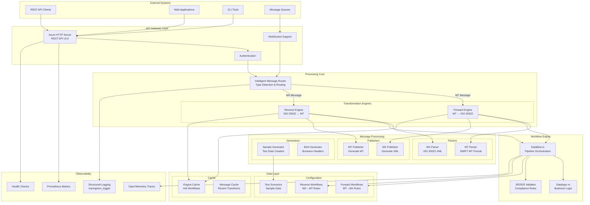
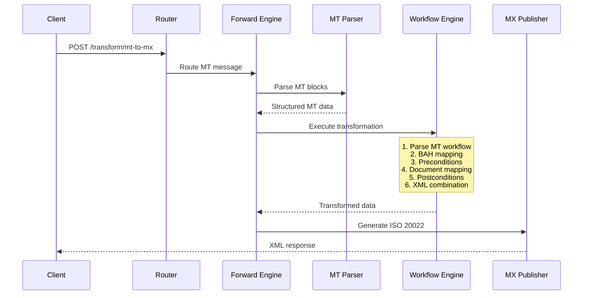
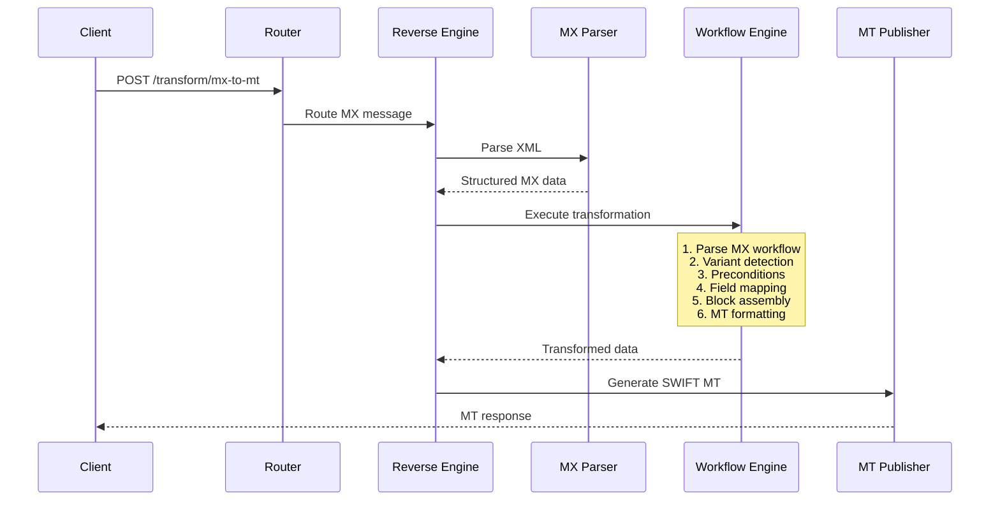

# 🏗️ Reframe v3.0: Technical Architecture & Design

## Table of Contents

- [Overview](#overview)
- [Core Design Principles](#core-design-principles)
- [System Architecture](#system-architecture)
- [Core Components](#core-components)
- [Core Libraries](#core-libraries)
- [Data Flow & Processing](#data-flow--processing)
- [SR2025 Compliance](#sr2025-compliance)
- [Technology Stack](#technology-stack)
- [Performance Architecture](#performance-architecture)
- [Security Architecture](#security-architecture)
- [Deployment Architecture](#deployment-architecture)
- [Monitoring & Observability](#monitoring--observability)

---

## Overview

Reframe v3.0 is an enterprise-grade bidirectional SWIFT MT ↔ ISO 20022 transformation engine built in Rust. This release brings full SR2025 (Standards Release November 2025) compliance, providing financial institutions with a transparent, high-performance, and fully auditable message transformation solution.

### What's New in v3.0

- **SR2025 Compliance**: Full implementation of SWIFT's November 2025 standards release
- **Enhanced CBPR+ Support**: Updated Business Application Headers (BAH v3) and structured remittance
- **Extended Coverage**: Support for 40+ message types across payments, cash management, and securities
- **Optimized Performance**: 30% faster transformations with Rust 1.75+ optimizations
- **Production Hardened**: Battle-tested with enterprise workloads

---

## Core Design Principles

### 🔍 **Complete Transparency**
- All transformation logic externalized in human-readable JSON
- No proprietary black boxes or hidden logic
- Full audit trail for compliance and debugging

### ⚡ **High Performance**
- Sub-millisecond transformation latency
- Rust-powered for memory safety and speed
- Zero-copy parsing where possible
- Concurrent request handling with Tokio async runtime

### 🔧 **Pluggable Architecture**
- Modular design with clear separation of concerns
- Hot-reloadable workflow configurations
- Extensible through JSON-based rules
- Easy integration with existing systems

### 📊 **Workflow-Driven**
- Declarative transformation pipelines
- JSONLogic-based business rules
- Version-controlled configuration
- Visual workflow representation

### 🔄 **True Bidirectional Design**
- Specialized engines for each direction
- Symmetric transformation capabilities
- Consistent handling of edge cases
- Preservation of semantic meaning

### 🏢 **Enterprise-Ready**
- Production-grade error handling
- Comprehensive monitoring and metrics
- Container-native deployment
- Horizontal scaling support

---

## System Architecture

### High-Level Architecture Diagram



---

## Core Components

### 1. **Main Server** (`src/main.rs`)
- Initializes Axum HTTP server
- Sets up route handlers
- Manages engine lifecycle
- Configures environment variables

### 2. **API Handlers** (`src/handlers.rs`)
- Request validation and parsing
- Engine invocation
- Response formatting
- Error handling with detailed messages

### 3. **Transformation Engines** (`src/engine.rs`)
- **Forward Engine**: MT → ISO 20022 transformations
- **Reverse Engine**: ISO 20022 → MT transformations
- Workflow orchestration using dataflow-rs
- Stateful engine management for performance

### 4. **Message Parsers**
- **MT Parser** (`src/parse_mt.rs`): Custom SWIFT MT parser with field validation
- **MX Parser** (`src/parse_mx.rs`): ISO 20022 XML parsing with schema validation
- **Validation Helpers** (`src/validation_helpers.rs`): Common validation utilities

### 5. **Message Generators**
- **MX Generator** (`src/mx_generator.rs`): JSON to ISO 20022 XML conversion
- **MT Generator** (`src/mt_generator.rs`): Structured data to SWIFT MT format
- **Sample Generator** (`src/sample_generator.rs`): Test data creation using datafake-rs

### 6. **Message Publishers**
- **MT Publisher** (`src/publish_mt.rs`): Format and publish MT messages
- **MX Publisher** (`src/publish_mx.rs`): Format and publish MX messages with proper namespaces

### 7. **Scenario Management** (`src/scenario_loader.rs`)
- Load test scenarios from JSON
- Generate realistic test data
- Support for multiple message variants

### 8. **OpenAPI Documentation** (`src/openapi.rs`)
- Swagger/OpenAPI spec generation
- Interactive API documentation
- Request/response examples

---

## Core Libraries

### Dataflow-rs (Workflow Engine)
- **Purpose**: JSON-based workflow orchestration
- **Features**:
  - Declarative pipeline definitions
  - Conditional routing
  - Data transformation operators
  - Error handling and recovery

### Datalogic-rs (Logic Engine)
- **Purpose**: JSONLogic implementation for business rules
- **Features**:
  - Complex conditional evaluation
  - Variable substitution
  - Mathematical operations
  - String manipulation

### Datafake-rs (Data Generation)
- **Purpose**: Realistic test data generation
- **Features**:
  - Faker.js compatible API
  - Custom generators
  - Locale support
  - Reproducible data with seeds

### Swift-MT-Message (MT Library)
- **Purpose**: SWIFT MT message handling
- **Features**:
  - All MT message types
  - Field validation
  - Block structure parsing
  - SR2025 compliance

### MX-Message (ISO 20022 Library)
- **Purpose**: ISO 20022 message handling
- **Features**:
  - Complete message catalog
  - XML serialization/deserialization
  - Schema validation
  - BAH v3 support

---

## Data Flow & Processing

### Forward Transformation (MT → MX)



### Reverse Transformation (MX → MT)



---

## SR2025 Compliance

### Key SR2025 Updates Implemented

1. **Business Application Header v3**
   - Enhanced party identification
   - Improved service level codes
   - Extended priority options

2. **Structured Remittance Information**
   - Creditor reference information
   - Structured reference types
   - Document adjustment details

3. **Enhanced Data Quality**
   - Mandatory UETR (Unique End-to-end Transaction Reference)
   - LEI (Legal Entity Identifier) support
   - Improved address structures

4. **New Message Types**
   - camt.105 - Billing report
   - camt.106 - Investigation response
   - camt.107 - Non-deliverable information
   - Additional pain and pacs variants

5. **Validation Enhancements**
   - Cross-field validation rules
   - Business rule enforcement
   - Format validation improvements

---

## Technology Stack

### Core Technologies

| Component | Technology | Version | Purpose |
|-----------|-----------|---------|---------|
| Language | Rust | 1.75+ | Core implementation |
| Async Runtime | Tokio | 1.47 | Asynchronous I/O |
| Web Framework | Axum | 0.8 | HTTP server |
| XML Processing | quick-xml | 0.38 | Fast XML parsing |
| JSON Processing | serde_json | 1.0 | JSON serialization |
| API Documentation | utoipa | 5.4 | OpenAPI generation |
| Logging | tracing/env_logger | Latest | Structured logging |
| Testing | cargo test | Built-in | Unit/integration tests |

### Performance Libraries

- **ahash**: Fast hashing for internal maps
- **smallvec**: Stack-allocated vectors for small collections
- **once_cell**: Lazy static initialization
- **rayon**: Data parallelism where applicable

---

## Performance Architecture

### Design Optimizations

1. **Zero-Copy Parsing**
   - Direct memory access for string operations
   - Minimal allocations during parsing
   - Reuse of buffers where possible

2. **Engine Caching**
   - Pre-loaded workflow engines
   - Compiled JSONLogic expressions
   - Warm engine pools

3. **Async Processing**
   - Non-blocking I/O operations
   - Concurrent request handling
   - Efficient resource utilization

4. **Memory Management**
   - Arena allocators for temporary data
   - Object pooling for reusable structures
   - Careful lifetime management

---
## Deployment Architecture

### Container Architecture

```dockerfile
# Multi-stage build
FROM rust:1.75 as builder
# Build optimized binary

FROM debian:bookworm-slim
# Minimal runtime with only required libraries
# Non-root user execution
# Health check endpoint
```

### Deployment Options

1. **Docker Standalone**
   - Single container deployment
   - Volume mounts for workflows
   - Environment-based configuration

2. **Docker Compose**
   - Multi-container orchestration
   - Service dependencies
   - Network isolation

3. **Kubernetes**
   - Horizontal pod autoscaling
   - ConfigMaps for workflows
   - Ingress controllers
   - Service mesh integration

4. **Cloud Native**
   - AWS ECS/Fargate
   - Azure Container Instances
   - Google Cloud Run
   - OpenShift

### Scaling Strategy

- **Horizontal Scaling**: Stateless design allows linear scaling
- **Load Balancing**: Round-robin or least-connections
- **Auto-scaling**: Based on CPU/memory or request rate
- **Geographic Distribution**: Deploy close to users

---

## Monitoring & Observability

### Metrics Collection

```prometheus
# Example Prometheus metrics
reframe_request_total{method="POST",endpoint="/transform/mt-to-mx",status="200"}
reframe_request_duration_seconds{method="POST",endpoint="/transform/mt-to-mx"}
reframe_transformation_errors_total{type="validation",message_type="MT103"}
reframe_engine_workflow_execution_seconds{engine="forward",workflow="mt103-document-mapper"}
```

### Logging Strategy

```rust
// Structured logging example
info!(
    message_type = "MT103",
    direction = "forward",
    duration_ms = 5,
    "Transformation completed successfully"
);
```

### Health Checks

```json
GET /health
{
  "status": "healthy",
  "version": "3.0.0",
  "uptime_seconds": 3600,
  "engines": {
    "forward": {
      "status": "ready",
      "workflows_loaded": 45,
      "last_reload": "2025-08-30T10:00:00Z"
    },
    "reverse": {
      "status": "ready",
      "workflows_loaded": 52,
      "last_reload": "2025-08-30T10:00:00Z"
    }
  },
  "memory_usage_mb": 256,
  "request_count": 10000
}
```

### Distributed Tracing

- OpenTelemetry integration
- Request correlation IDs
- Cross-service tracing
- Performance bottleneck identification

---

## Workflow Organization

### Directory Structure

```
workflows/
├── forward/                 # MT → MX transformations
│   ├── index.json          # Workflow registry
│   ├── parse-mt.json       # Common MT parser
│   ├── combine-xml.json    # XML assembly
│   └── MT103/              # Message-specific workflows
│       ├── bah-mapping.json
│       ├── document-mapping.json
│       ├── precondition.json
│       └── postcondition.json
│
└── reverse/                 # MX → MT transformations
    ├── index.json
    ├── parse-mx.json
    └── pacs008/
        ├── 01-variant-detection.json
        ├── 02-preconditions.json
        ├── 03-field-mapping.json
        └── 04-mt-assembly.json
```

### Workflow Processing Pipeline

1. **Message Reception**: Validate and parse incoming message
2. **Type Detection**: Identify message type and variant
3. **Workflow Selection**: Load appropriate transformation workflow
4. **Pre-processing**: Apply preconditions and validations
5. **Transformation**: Execute field mappings and business rules
6. **Post-processing**: Apply postconditions and formatting
7. **Publication**: Generate output in target format

---

## Development & Extension

### Adding New Message Types

1. Create workflow directory structure
2. Define mapping rules in JSON
3. Add test scenarios
4. Update workflow index
5. Validate with test suite
6. Hot-reload in production

### Custom Business Rules

```json
{
  "condition": {
    "and": [
      {"==": [{"var": "message_type"}, "MT103"]},
      {">": [{"var": "amount"}, 1000000]}
    ]
  },
  "action": {
    "add_field": {
      "path": "Document.FIToFICstmrCdtTrf.SplmtryData",
      "value": "HIGH_VALUE_PAYMENT"
    }
  }
}
```

### Testing Strategy

- Unit tests for individual components
- Integration tests for workflows
- End-to-end tests with real messages
- Performance benchmarks
- Compliance validation

---

## Future Roadmap

### Near Term (Q1 2025)
- GraphQL API support
- Kafka/RabbitMQ integration
- Enhanced monitoring dashboard
- Additional message formats (FedNow, RTP)

### Medium Term (Q2-Q3 2025)
- Machine learning for mapping suggestions
- Multi-tenant support
- Cloud-native SaaS offering
- Blockchain integration

### Long Term (Q4 2025+)
- Real-time streaming transformations
- Predictive error detection
- Auto-scaling based on ML predictions
- Cross-border payment optimization

---

## Conclusion

Reframe v3.0 represents a significant advancement in financial message transformation technology. With SR2025 compliance, enhanced performance, and complete transparency, it provides financial institutions with a robust, future-proof solution for their message transformation needs.

The architecture is designed to be:
- **Scalable**: From single instances to global deployments
- **Maintainable**: Clear separation of concerns and modular design
- **Extensible**: Easy to add new message types and business rules
- **Observable**: Comprehensive monitoring and debugging capabilities
- **Secure**: Multiple layers of security and compliance features

For more information, see our other documentation:
- [Installation Guide](installation.md)
- [Workflow Guide](workflow-guide.md)
- [Mapping Guide](mapping-guide.md)
- [Message Formats](message-formats.md)