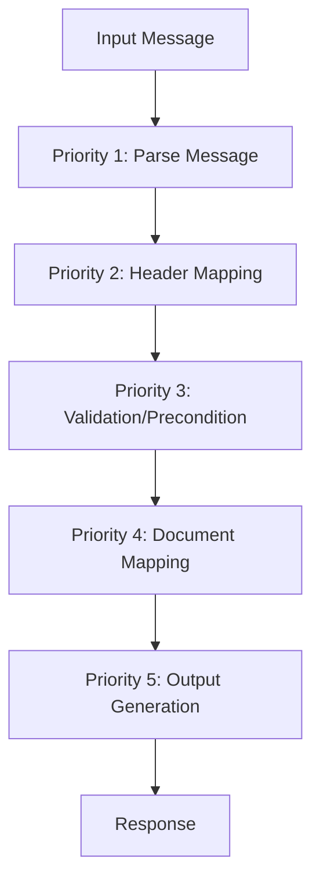

# 📊 Workflow Guide

Comprehensive guide to creating and configuring transformation workflows in Reframe.

## Table of Contents
- [Overview](#overview)
- [Workflow Architecture](#workflow-architecture)
- [Workflow Structure](#workflow-structure)
- [Configuration Examples](#configuration-examples)
- [Best Practices](#best-practices)
- [Troubleshooting](#troubleshooting)

---

## Overview

Reframe's workflow system is built on **[dataflow-rs](https://github.com/GoPlasmatic/dataflow-rs)**, a powerful Rust-based workflow engine for data processing pipelines. All transformation logic is externalized in JSON files using **[datalogic-rs](https://github.com/GoPlasmatic/datalogic-rs)** for conditional logic, making the system completely auditable and customizable.

### Key Features

- **🔍 Complete Transparency**: All transformation logic visible in JSON workflow files
- **🔧 Runtime Configuration**: Modify workflows without recompilation
- **📊 Bidirectional Support**: Separate workflow engines for each direction
- **🎯 Message-Specific**: Dedicated workflows for each message type
- **🔗 Priority-Based Execution**: Sequential workflow processing based on priority
- **✅ JSON Logic Integration**: Complex conditional logic via [datalogic-rs](https://github.com/GoPlasmatic/datalogic-rs)

### Technology Stack

- **Workflow Engine**: [dataflow-rs](https://github.com/GoPlasmatic/dataflow-rs) - Rust-based data processing pipeline engine
- **Logic Engine**: [datalogic-rs](https://github.com/GoPlasmatic/datalogic-rs) - JSON Logic implementation for declarative transformations

---

## Workflow Architecture

### Directory Structure

```
workflows/
├── forward/                    # MT → ISO 20022 transformations
│   ├── index.json             # Forward workflow loading order
│   ├── parse-mt.json          # MT message parser (priority 1)
│   ├── MT103/                 # MT103 specific workflows
│   │   ├── bah-mapping.json   # Business Application Header (priority 2)
│   │   ├── precondition.json  # Validation rules (priority 3)
│   │   └── document-mapping.json  # Document content (priority 4)
│   ├── combine-xml.json       # Final XML assembly (priority 5)
│   └── ...
└── reverse/                   # ISO 20022 → MT transformations
    ├── index.json             # Reverse workflow loading order
    ├── parse-mx.json          # MX message parser (priority 1)
    ├── pacs008/               # pacs.008 specific workflows
    │   └── field-mapping.json # Field mapping rules (priority 2)
    └── ...
```

### Processing Flow



---

## Workflow Structure

### Root Workflow Definition

```json
{
  "id": "mt103-document-mapper",
  "name": "MT103 to pacs.008 Document Mapping for CBPR+",
  "description": "Maps MT103 message to ISO 20022 pacs.008.001.08 document structure",
  "priority": 4,
  "condition": {
    "and": [
      {"==": [{"var": "SwiftMT.message_type"}, "103"]},
      {"in": [{"var": "SwiftMT.method"}, ["normal", "stp"]]},
      {"==": [{"var": "progress.workflow_id"}, "mt103-precondition"]},
      {"==": [{"var": "progress.status_code"}, 200]}
    ]
  },
  "tasks": [...]
}
```

### Task Structure

```json
{
  "id": "construct_business_application_header",
  "name": "Construct Business Application Header",
  "description": "Build ISO 20022 Business Application Header from MT headers",
  "condition": {
    "==": [{"var": "SwiftMT.method"}, "normal"]
  },
  "function": {
    "name": "map",
    "input": {
      "mappings": [
        {
          "path": "data.AppHdr.Fr.FIId.FinInstnId.BICFI",
          "logic": {"var": "temp_data.Sender"}
        }
      ]
    }
  }
}
```

### Function Types

#### Built-in Functions (from dataflow-rs)
- **`map`**: Field mapping and transformation using JSON Logic
- **`validate`**: Business rule validation

#### Custom Functions (registered in Reframe)
- **`ParseMT`**: SWIFT MT message parsing
- **`ParseMX`**: ISO 20022 MX message parsing  
- **`PublishMX`**: ISO 20022 XML generation
- **`PublishMT`**: SWIFT MT message generation

---

## Configuration Examples

### 1. Field Mapping with JSON Logic

```json
{
  "id": "map_settlement_method",
  "name": "Determine Settlement Method",
  "function": {
    "name": "map",
    "input": {
      "mappings": [
        {
          "path": "temp_data.settlement_method",
          "logic": {
            "if": [
              {"and": [
                {"!": {"var": "data.SwiftMT.fields.53A"}},
                {"!": {"var": "data.SwiftMT.fields.54A"}}
              ]},
              "INDA",
              {
                "if": [
                  {"var": "data.SwiftMT.fields.53A.bic.raw"},
                  {
                    "if": [
                      {"==": [
                        {"substr": [{"var": "data.SwiftMT.fields.53A.bic.raw"}, 0, 6]},
                        {"substr": [{"var": "temp_data.Sender"}, 0, 6]}
                      ]},
                      "INDA",
                      "COVE"
                    ]
                  },
                  "COVE"
                ]
              }
            ]
          }
        }
      ]
    }
  }
}
```

### 2. Conditional Field Construction

```json
{
  "id": "construct_group_header",
  "name": "Construct Group Header",
  "function": {
    "name": "map",
    "input": {
      "mappings": [
        {
          "path": "data.Document.FIToFICstmrCdtTrf.GrpHdr",
          "logic": {
            "MsgId": {
              "if": [
                {"var": "data.SwiftMT.fields.20.value"},
                {"var": "data.SwiftMT.fields.20.value"},
                "NOTPROVIDED"
              ]
            },
            "CreDtTm": {
              "if": [
                {"var": "data.SwiftMT.fields.32A.value_date"},
                {
                  "cat": [
                    {"var": "data.SwiftMT.fields.32A.value_date"},
                    "T",
                    {"format_date": [{"now": []}, "HH:mm:ss"]},
                    "+00:00"
                  ]
                },
                "9999-12-31T00:00:00+00:00"
              ]
            },
            "TtlIntrBkSttlmAmt": {
              "@Ccy": {
                "if": [
                  {"var": "data.SwiftMT.fields.32A.currency"},
                  {"var": "data.SwiftMT.fields.32A.currency"},
                  "USD"
                ]
              },
              "$value": {
                "if": [
                  {"var": "data.SwiftMT.fields.32A.amount"},
                  {"var": "data.SwiftMT.fields.32A.amount"},
                  0.0
                ]
              }
            }
          }
        }
      ]
    }
  }
}
```

### 3. Validation Rules

```json
{
  "id": "validate_preconditions",
  "name": "Validate Preconditions",
  "function": {
    "name": "validate",
    "input": {
      "rules": [
        {
          "path": "data.ISO20022_MX.document.CdtTrfTxInf.IntrBkSttlmAmt.@Ccy",
          "logic": {
            "!": {
              "in": [
                {"var": "data.ISO20022_MX.document.CdtTrfTxInf.IntrBkSttlmAmt.@Ccy"},
                ["XAU", "XAG", "XPD", "XPT"]
              ]
            }
          },
          "message": "T20054: Commodities currencies not allowed in Field 32A"
        }
      ]
    }
  }
}
```

### 4. Publisher Function

```json
{
  "id": "generate_document_xml",
  "name": "Generate Document XML",
  "condition": {"==": [{"var": "SwiftMT.method"}, "normal"]},
  "function": {
    "name": "PublishMX",
    "input": {
      "input_field_name": "Document",
      "output_field_name": "document_xml",
      "source_format": "MT103.Document"
    }
  }
}
```

---

## Best Practices

### 1. Workflow Organization

- **Priority-Based Execution**: Use priorities 1-5 for proper sequencing
- **Condition Checks**: Always validate previous workflow completion
- **Temporary Data**: Use `temp_data` for intermediate calculations
- **Clear Naming**: Use descriptive IDs and names for workflows and tasks

### 2. JSON Logic Patterns

- **Defensive Programming**: Always provide fallback values with `if` statements
- **Field Existence**: Check field existence before accessing nested properties
- **Type Safety**: Validate data types before transformations

### 3. Error Handling

```json
{
  "logic": {
    "if": [
      {"var": "data.SwiftMT.fields.20.value"},
      {"var": "data.SwiftMT.fields.20.value"},
      "NOTPROVIDED"
    ]
  }
}
```

---

## Troubleshooting

### Common Issues

#### 1. Workflow Not Executing

**Problem**: Workflow conditions not met

**Solution**: Check condition logic and progress tracking:
```bash
# Enable debug logging
RUST_LOG=debug,dataflow_rs=trace cargo run

# Check workflow conditions
jq '.condition' workflows/forward/MT103/document-mapping.json
```

#### 2. Field Mapping Errors

**Problem**: JSON Logic returns null/undefined

**Solution**: Add defensive checks:
```json
{
  "if": [
    {"var": "data.SwiftMT.fields.20"},
    {"var": "data.SwiftMT.fields.20.value"},
    "NOTPROVIDED"
  ]
}
```

#### 3. Validation Failures

**Problem**: Validation rules too strict

**Solution**: Test validation logic:
```bash
# Test individual workflows
curl -X POST http://localhost:3000/test-workflow \
  -H "Content-Type: application/json" \
  -d '{"workflow": "MT103/precondition.json", "input": {...}}'
```

### Debugging Workflows

#### Enable Detailed Logging
```bash
# Maximum verbosity for dataflow-rs
RUST_LOG=trace,dataflow_rs=trace cargo run
```

#### Workflow Execution Analysis
- Check `progress.workflow_id` and `progress.status_code` values
- Verify `temp_data` intermediate calculations
- Validate JSON Logic expressions with sample data

---

## Advanced Features

### Dynamic Field Selection

Select between optional SWIFT fields:
```json
{
  "Nm": {
    "if": [
      {"var": "data.SwiftMT.fields.50.K.lines"},
      {
        "if": [
          {">": [{"length": {"var": "data.SwiftMT.fields.50.K.lines"}}, 1]},
          {"var": "data.SwiftMT.fields.50.K.lines.1"},
          {"var": "data.SwiftMT.fields.50.K.lines.0"}
        ]
      },
      {
        "if": [
          {"var": "data.SwiftMT.fields.50A.name_and_address"},
          {"var": "data.SwiftMT.fields.50A.name_and_address.0"},
          "NOTPROVIDED"
        ]
      }
    ]
  }
}
```

### Complex Business Logic

CBPR+ settlement method determination:
```json
{
  "settlement_method": {
    "if": [
      {"and": [
        {"!": {"var": "data.SwiftMT.fields.53A"}},
        {"!": {"var": "data.SwiftMT.fields.54A"}}
      ]},
      "INDA",
      {
        "if": [
          {"and": [
            {"var": "data.SwiftMT.fields.53B.party_identifier"},
            {"starts_with": [{"var": "data.SwiftMT.fields.53B.party_identifier"}, "/C"]}
          ]},
          "INGA",
          "COVE"
        ]
      }
    ]
  }
}
```

---

## Next Steps

1. **[Mapping Guide](mapping-guide.md)** - Learn detailed field mapping patterns and JSON Logic syntax
2. **[Architecture](architecture.md)** - Understand the technical architecture and dataflow-rs integration
3. **[Message Formats](message-formats.md)** - Complete list of supported message types and workflows

---

## Additional Resources

- **[dataflow-rs](https://github.com/GoPlasmatic/dataflow-rs)** - The underlying workflow engine powering Reframe's transformation pipelines
- **[datalogic-rs](https://github.com/GoPlasmatic/datalogic-rs)** - JSON Logic implementation for conditional logic and transformations

---

*Last updated: January 2024*